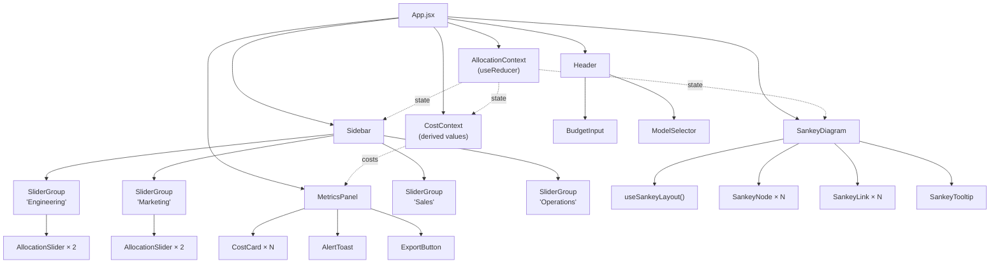

# Agent Swarm Token Allocator — Architecture Design v2

A local-first dashboard for visualizing and managing LLM token budgets across AI agent fleets. Built with **React + Vite + D3.js** for the OpenAI Build Week hackathon.

---

## User Review Required

> [!IMPORTANT]
> **React + Vite confirmed.** This plan uses React 19 with Vite for instant HMR, ES module dev server, and production builds. D3.js handles Sankey math only — React owns all DOM rendering. This gives us component reuse, clean state management, and enterprise-grade architecture that impresses judges.

> [!WARNING]
> **No Tailwind by default.** The plan uses vanilla CSS with CSS Modules and OKLCH design tokens (per Impeccable skill guidelines). If you want Tailwind, say so now — it changes the file structure.

## Open Questions

1. **Model pricing** — Hardcoded current OpenAI pricing or user-editable table? (I'm leaning hardcoded + editable override)
2. **Default agent count** — Planning 4 departments × 2 agents each = 8 agents. Enough for demo impact?
3. **Dark mode only?** — Cleaner for hackathon. Skip light mode toggle?
4. **Export JSON schema** — Generic, or aligned to a specific orchestrator format (LangChain, CrewAI, etc.)?

---

## Part 1: Enterprise Vision (The Full Picture)

This is what you explain to judges. You're building **Phase 1** (the Control Plane); the rest is the scaling story.

### System Architecture — 4 Layers

```mermaid
graph TD
    subgraph Frontend["1. Control Plane (What We're Building)"]
        UI["Allocator Dashboard<br/>(React + Vite)"] -->|"User sets limits"| Config["Generate JSON Config"]
        Viz["Live Sankey Viz<br/>(D3.js)"] <--|"Reads live usage"| DB
    end

    subgraph Backend["2. Data Plane (Enterprise Proxy)"]
        API["Management API<br/>(REST/gRPC)"] <--|"Saves Config"| DB[("Redis / PostgreSQL")]
        Proxy["LLM API Gateway"]
        Counter["Token Counter<br/>& Rate Limiter"]
    end

    subgraph Swarm["3. Active Agents"]
        EngAgent["🔧 Engineering<br/>Code Reviewer"]
        MktAgent["📢 Marketing<br/>SEO Bot"]
        SalesAgent["💼 Sales<br/>Lead Scorer"]
        OpsAgent["📊 Operations<br/>Data Analyst"]
    end

    subgraph LLM["4. OpenAI"]
        GPT["GPT-5.6 Sol/Terra/Luna<br/>Codex APIs"]
    end

    Config -->|"Push Settings"| API
    EngAgent & MktAgent & SalesAgent & OpsAgent -->|"1. Send Prompt"| Proxy
    Proxy -->|"2. Check Budget"| Counter
    Counter <-->|"3. Verify Limits"| DB
    Counter -->|"4. If Approved"| GPT
    GPT -->|"5. Response + Usage Metadata"| Proxy
    Proxy -->|"6. Log Tokens Spent"| DB
    Proxy -->|"7. Return Answer"| EngAgent
```

### The 4-Phase Real-Time Workflow

| Phase | Name | What Happens | Your Prototype Covers |
|---|---|---|---|
| **1** | Budget Allocation | Manager opens dashboard, drags sliders, generates `config.json` | ✅ **Yes — this is the demo** |
| **2** | Interception | Agent calls your Gateway instead of `api.openai.com` directly | 📋 Explained in pitch |
| **3** | Validation | Gateway checks budget → approve (forward to OpenAI) or block (429 error) | 📋 Explained in pitch |
| **4** | Telemetry Loop | Gateway logs tokens spent → Dashboard reads DB → Sankey updates live | ⚡ Simulated with mock data |

> [!TIP]
> **Hackathon strategy**: Build Phase 1 fully. Simulate Phase 4 with a "Simulate Live Usage" button that animates token burn-down on the Sankey. Explain Phases 2–3 with the architecture diagram in your demo video.

---

## Part 2: Frontend Architecture (What We're Building)

### Tech Stack

| Layer | Choice | Rationale |
|---|---|---|
| Framework | **React 19** | Component model maps 1:1 to UI elements; reactive state handles slider normalization naturally |
| Build tool | **Vite 6** | <1s dev server start, instant HMR, zero-config React setup |
| Visualization | **D3.js v7 + d3-sankey** | D3 computes layout math → React renders SVG elements (no DOM fighting) |
| Styling | **Vanilla CSS + CSS Modules** | OKLCH design tokens, glassmorphism, no framework overhead |
| Fonts | **Inter + JetBrains Mono** | Google Fonts CDN |
| State | **useReducer + Context** | Lightweight, no extra dependency, perfect for this complexity level |

### Project Structure

```
Agent-Swarm-Token-Allocator/
├── index.html
├── vite.config.js
├── package.json
├── public/
│   └── favicon.svg
├── src/
│   ├── main.jsx                      # React DOM root
│   ├── App.jsx                       # Layout shell + providers
│   │
│   ├── context/
│   │   ├── AllocationContext.jsx      # useReducer store + provider
│   │   └── CostContext.jsx           # Derived cost calculations
│   │
│   ├── components/
│   │   ├── layout/
│   │   │   ├── Header.jsx            # Logo, budget input, model selector
│   │   │   ├── Header.module.css
│   │   │   ├── Sidebar.jsx           # Slider panels
│   │   │   ├── Sidebar.module.css
│   │   │   ├── MetricsPanel.jsx      # Cost cards + alerts
│   │   │   └── MetricsPanel.module.css
│   │   │
│   │   ├── sankey/
│   │   │   ├── SankeyDiagram.jsx     # D3 layout → React SVG
│   │   │   ├── SankeyDiagram.module.css
│   │   │   ├── SankeyNode.jsx        # Individual node rectangle
│   │   │   ├── SankeyLink.jsx        # Gradient path between nodes
│   │   │   └── SankeyTooltip.jsx     # Hover tooltip
│   │   │
│   │   ├── controls/
│   │   │   ├── SliderGroup.jsx       # Department slider + nested agents
│   │   │   ├── SliderGroup.module.css
│   │   │   ├── AllocationSlider.jsx  # Single slider with normalization
│   │   │   ├── BudgetInput.jsx       # Total token budget number input
│   │   │   └── ModelSelector.jsx     # Dropdown for GPT model
│   │   │
│   │   └── feedback/
│   │       ├── CostCard.jsx          # Per-agent cost display
│   │       ├── CostCard.module.css
│   │       ├── AlertToast.jsx        # Threshold warning popup
│   │       ├── AlertBadge.jsx        # Inline warning indicator
│   │       └── ExportButton.jsx      # JSON download trigger
│   │
│   ├── hooks/
│   │   ├── useSankeyLayout.js        # D3 sankey computation hook
│   │   ├── useNormalization.js       # Slider normalization math
│   │   └── useAlerts.js              # Threshold monitoring hook
│   │
│   ├── data/
│   │   ├── defaultConfig.js          # Initial departments + agents
│   │   └── pricing.js                # OpenAI model pricing table
│   │
│   ├── utils/
│   │   ├── costCalculator.js         # Token → dollar math
│   │   ├── exportConfig.js           # JSON generation + download
│   │   └── formatters.js             # Number/currency formatting
│   │
│   └── styles/
│       ├── tokens.css                # OKLCH colors, type scale, spacing
│       ├── global.css                # Reset, body, scrollbar, fonts
│       └── animations.css            # Keyframes, transitions
│
├── .agents/
│   └── skills/                       # Impeccable skill
└── README.md
```

---

### Component Architecture



---

### State Management — `AllocationContext`

Uses `useReducer` with a clear action set:

```javascript
// State shape
{
  totalBudget: 10_000_000,          // tokens/month
  selectedModel: "gpt-5.6-terra",
  departments: [
    {
      id: "eng",
      name: "Engineering",
      color: "oklch(0.75 0.15 200)",  // cyan
      allocation: 40,                  // percentage
      agents: [
        { id: "code-review", name: "Code Review Agent", allocation: 60 },
        { id: "debug",       name: "Debug Agent",       allocation: 40 },
      ]
    },
    // ... Marketing, Sales, Operations
  ],
  thresholds: { warning: 80, danger: 95 }
}

// Action types
SET_TOTAL_BUDGET        // User changes the monthly token number
SET_MODEL               // User selects a different GPT model
SET_DEPT_ALLOCATION     // Department slider moved → triggers normalization
SET_AGENT_ALLOCATION    // Agent slider moved → triggers normalization
ADD_AGENT               // Future: add new agent to department
REMOVE_AGENT            // Future: remove agent
```

**Normalization reducer logic** (the critical algorithm):

```
Action: SET_DEPT_ALLOCATION { deptId: "eng", value: 50 }

1. Set departments["eng"].allocation = 50
2. remaining = 100 - 50 = 50
3. othersCurrentTotal = sum(mkt + sales + ops) = 60
4. For each other dept:
     dept.allocation = (dept.allocation / othersCurrentTotal) × remaining
     // mkt: (25/60)×50 = 20.83
     // sales: (20/60)×50 = 16.67
     // ops: (15/60)×50 = 12.50
5. Round to 2 decimal places, adjust last value to guarantee sum = 100
```

---

### D3 + React Integration — `useSankeyLayout` Hook

The key pattern: **D3 computes, React renders.**

```
┌─────────────────────────────────────────────────────┐
│ useSankeyLayout(state)                              │
│                                                     │
│ 1. Transform state → { nodes[], links[] }           │
│ 2. Call d3.sankey() to compute x, y, width, height  │
│ 3. Return computed layout as plain JS objects        │
│                                                     │
│ React renders:                                      │
│ ┌─────────────────────────────────────┐             │
│ │ <svg>                               │             │
│ │   {links.map(l => <SankeyLink />)}  │ ← React    │
│ │   {nodes.map(n => <SankeyNode />)}  │ ← React    │
│ │ </svg>                              │             │
│ └─────────────────────────────────────┘             │
│                                                     │
│ D3 never touches the DOM. Zero conflicts.           │
└─────────────────────────────────────────────────────┘
```

**Sankey topology** — 3 columns of nodes:

```
Column 0 (Source)    Column 1 (Departments)    Column 2 (Agents)
─────────────────    ──────────────────────    ─────────────────────
                     ┌─ Engineering (40%) ──→  Code Review Agent
Total Budget ────────┤                    ──→  Debug Agent
(10M tokens)         ├─ Marketing (25%) ───→  Content Agent
                     │                    ──→  SEO Agent
                     ├─ Sales (20%) ───────→  Lead Scoring Agent
                     │                    ──→  Email Drafter Agent
                     └─ Operations (15%) ──→  Data Analysis Agent
                                          ──→  Reporting Agent
```

**Visual features of links:**

| Feature | Implementation |
|---|---|
| Gradient fill | SVG `<linearGradient>` from source color → target color, applied as `stroke` |
| Width | Proportional to token value (d3-sankey computes this) |
| Hover highlight | Opacity boost to 1.0, others fade to 0.2 |
| Animated flow | CSS `stroke-dashoffset` animation simulating token flow direction |
| Alert coloring | Overrides gradient with red/amber when threshold exceeded |

---

### Cost Engine — `utils/costCalculator.js`

**Pricing data** (`data/pricing.js`):

```javascript
export const MODELS = {
  "gpt-5.6-sol":   { name: "GPT-5.6 Sol",   input: 5.00,  output: 30.00, cached: 0.50  },
  "gpt-5.6-terra": { name: "GPT-5.6 Terra",  input: 2.50,  output: 15.00, cached: 0.25  },
  "gpt-5.6-luna":  { name: "GPT-5.6 Luna",   input: 1.00,  output: 6.00,  cached: 0.10  },
  "gpt-5.4-nano":  { name: "GPT-5.4 Nano",   input: 0.20,  output: 1.25,  cached: 0.02  },
};
// All prices per 1M tokens
```

**Per-agent cost formula:**

```
agentTokens = totalBudget × (deptAllocation / 100) × (agentAllocation / 100)

inputTokens  = agentTokens × 0.70   // 70% of usage is input (configurable)
outputTokens = agentTokens × 0.30   // 30% is output

inputCost  = (inputTokens  / 1_000_000) × model.input
outputCost = (outputTokens / 1_000_000) × model.output
totalCost  = inputCost + outputCost
```

The `CostContext` derives these values reactively whenever `AllocationContext` state changes.

---

### Alert System — `hooks/useAlerts.js`

Monitors each agent's effective allocation against configurable thresholds:

```
effectivePercent = (deptAllocation / 100) × (agentAllocation / 100) × 100

if effectivePercent >= danger (95%):  → RED pulse + 🚨 toast
if effectivePercent >= warning (80%): → AMBER pulse + ⚠️ badge
else:                                 → Normal styling
```

| Alert Level | Sankey Node | Sidebar Card | Notification |
|---|---|---|---|
| **Normal** | Default color fill | Standard card | None |
| **Warning** | Amber border glow | ⚠️ badge + amber accent | None (inline only) |
| **Danger** | Red pulsing glow + animated border | 🚨 badge + red accent | Toast slides in from right |

---

### Design System — `styles/tokens.css`

Following **Impeccable** skill principles (anti-AI-slop):

```css
:root {
  /* OKLCH Palette — perceptually uniform, no generic blue/red */
  --bg-deep:       oklch(0.13 0.02 260);
  --bg-surface:    oklch(0.18 0.015 260);
  --bg-elevated:   oklch(0.22 0.015 260);
  --bg-glass:      oklch(0.20 0.01 260 / 0.6);

  /* Agent category colors — distinct, vibrant, harmonious */
  --color-engineering: oklch(0.75 0.15 200);   /* cyan */
  --color-marketing:   oklch(0.72 0.18 300);   /* violet */
  --color-sales:       oklch(0.80 0.16 85);    /* amber */
  --color-operations:  oklch(0.75 0.17 155);   /* emerald */

  /* Semantic */
  --color-warning:  oklch(0.82 0.18 80);       /* warm amber */
  --color-danger:   oklch(0.65 0.25 25);       /* hot red */
  --color-success:  oklch(0.78 0.17 150);      /* green */

  /* Typography */
  --font-body: 'Inter', system-ui, sans-serif;
  --font-mono: 'JetBrains Mono', monospace;

  /* Fluid type scale */
  --text-xs:  clamp(0.6875rem, 0.625rem + 0.25vw, 0.8125rem);
  --text-sm:  clamp(0.8125rem, 0.75rem + 0.25vw, 0.9375rem);
  --text-base: clamp(0.9375rem, 0.875rem + 0.25vw, 1.0625rem);
  --text-lg:  clamp(1.125rem, 1rem + 0.5vw, 1.375rem);
  --text-xl:  clamp(1.5rem, 1.25rem + 1vw, 2rem);
  --text-2xl: clamp(2rem, 1.5rem + 2vw, 3rem);

  /* Spacing (4px base, geometric) */
  --space-1: 0.25rem;  --space-2: 0.5rem;
  --space-3: 0.75rem;  --space-4: 1rem;
  --space-5: 1.5rem;   --space-6: 2rem;
  --space-8: 3rem;     --space-10: 4rem;

  /* Motion */
  --duration-fast: 150ms;
  --duration-normal: 300ms;
  --duration-slow: 500ms;
  --ease-spring: cubic-bezier(0.34, 1.56, 0.64, 1);
  --ease-smooth: cubic-bezier(0.4, 0, 0.2, 1);

  /* Glassmorphism */
  --glass-blur: 12px;
  --glass-border: 1px solid oklch(1 0 0 / 0.08);
  --shadow-elevated: 0 4px 24px oklch(0 0 0 / 0.3),
                     0 1px 4px oklch(0 0 0 / 0.2);
}
```

---

### UI Layout — Responsive Grid

```
≥1200px (Desktop):
┌─────────────────────────────────────────────────────────┐
│  HEADER: Logo ◆ Swarm Control  │ Budget: [___] │ Model ▼│
├──────────┬───────────────────────────────┬──────────────┤
│          │                               │              │
│ SIDEBAR  │     SANKEY DIAGRAM            │  METRICS     │
│ 280px    │     (flex: 1)                 │  320px       │
│          │                               │              │
│ ▸ Eng 40%│     ┌Budget┐                  │ Total: $482  │
│   ├ CR   │     │      ├─ Eng ─→ CR       │              │
│   └ Dbg  │     │      ├─ Mkt ─→ Content  │ ┌──────────┐│
│ ▸ Mkt 25%│     │      ├─ Sal ─→ Lead     │ │ CR Agent ││
│   ├ SEO  │     │      └─ Ops ─→ Data     │ │ $124/mo  ││
│   └ Cont │     └──────┘                  │ │ ⚠️ 82%   ││
│ ▸ Sal 20%│                               │ └──────────┘│
│ ▸ Ops 15%│                               │              │
│          │                               │ [📤 Export]  │
├──────────┴───────────────────────────────┴──────────────┤
│  FOOTER: "Built with Codex" │ Simulate Live Usage ▶    │
└─────────────────────────────────────────────────────────┘

768–1199px (Tablet): Sidebar collapses to top bar, Metrics below Sankey
<768px (Mobile): Single column stack
```

The grid is implemented with:
```css
.app-shell {
  display: grid;
  grid-template-columns: 280px 1fr 320px;
  grid-template-rows: auto 1fr auto;
  min-height: 100vh;
}
```

---

### Simulated Live Usage (Demo Feature)

A "▶ Simulate Live Usage" button in the footer that:

1. Starts a `setInterval` (every 500ms) that randomly "burns" tokens from agents
2. The Sankey links animate with `stroke-dashoffset` to show flow direction
3. Cost cards tick upward like a live counter
4. When an agent crosses a threshold, the alert system fires in real-time
5. Creates the illusion of the Phase 4 telemetry loop for the demo video

This is **pure frontend simulation** — no backend needed, but it sells the enterprise vision.

---

## Build Phases (Execution Order)

### Phase 1: Foundation (Core Sankey + Sliders)
| Step | Files | What |
|---|---|---|
| 1.1 | `vite.config.js`, `package.json` | Scaffold React + Vite project |
| 1.2 | `styles/tokens.css`, `global.css` | Design system + reset |
| 1.3 | `data/defaultConfig.js` | Default departments + agents data |
| 1.4 | `context/AllocationContext.jsx` | useReducer store + normalization |
| 1.5 | `hooks/useSankeyLayout.js` | D3 sankey computation hook |
| 1.6 | `components/sankey/*` | SankeyDiagram, Node, Link, Tooltip |
| 1.7 | `components/controls/*` | SliderGroup, AllocationSlider |
| 1.8 | `App.jsx` + layout components | Wire everything together |

### Phase 2: Intelligence (Cost + Alerts)
| Step | Files | What |
|---|---|---|
| 2.1 | `data/pricing.js` | OpenAI model pricing table |
| 2.2 | `utils/costCalculator.js` | Token → dollar conversion |
| 2.3 | `context/CostContext.jsx` | Derived cost state |
| 2.4 | `components/feedback/CostCard.jsx` | Per-agent cost display |
| 2.5 | `hooks/useAlerts.js` | Threshold monitoring |
| 2.6 | `components/feedback/AlertToast.jsx` | Toast notifications |
| 2.7 | `components/controls/BudgetInput.jsx` | Total budget number input |
| 2.8 | `components/controls/ModelSelector.jsx` | Model dropdown |

### Phase 3: Polish (Export + Demo)
| Step | Files | What |
|---|---|---|
| 3.1 | `utils/exportConfig.js` | JSON config generation |
| 3.2 | `components/feedback/ExportButton.jsx` | Download trigger |
| 3.3 | Simulate Live Usage button | Animated token burn-down |
| 3.4 | `animations.css` | Micro-animations, link flow effect |
| 3.5 | Responsive breakpoints | Tablet + mobile layouts |
| 3.6 | Final visual polish | Glassmorphism, glow effects, tooltips |

### Phase 4: Hackathon Submission
| Step | What |
|---|---|
| 4.1 | Enterprise architecture diagram (the Mermaid chart above) added to README |
| 4.2 | "Built with Codex" badge + pitch narrative in README |
| 4.3 | Production build (`vite build`) for deployment |

---

## Verification Plan

### Automated Tests
```bash
# Normalization math (sum always = 100%)
node src/utils/__tests__/normalization.test.js

# Cost calculation accuracy
node src/utils/__tests__/costCalculator.test.js

# Lint all JS/JSX
npx eslint src/ --ext .js,.jsx
```

### Manual Verification
- Open `http://localhost:5173`, verify Sankey renders with gradient links
- Move department sliders → verify other departments re-normalize, Sankey animates
- Move agent sliders within a department → verify sibling agents re-normalize
- Change total budget → verify all costs update
- Switch model → verify costs recalculate with new pricing
- Push allocation past 80% → verify amber warning
- Push allocation past 95% → verify red danger + toast
- Click Export → verify JSON file downloads with correct values
- Click "Simulate Live Usage" → verify animated burn-down
- Resize browser → verify responsive layout at all 3 breakpoints
- Test in Chrome + Firefox
